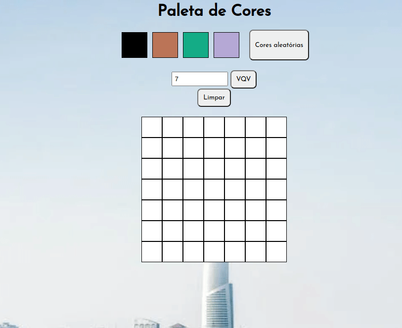

<h1>Olá,  
Bem-vindo ao meu repositório de projetos desenvolvidos no curso de formação Trybe!</h1>

Esse projeto foi desenvolvido durante minha formação no curso de desenvolvimento web pela Trybe.

<h1>O que a aplicação propõe?</h1>

O App Pixels Art se propõe a ser um aplicativo para criar desenhos em pixeis, permitindo a criatividade do usuário e salvando os desenhos e cores para uma próxima visita.

<h1>Arquivos desenvolvidos.</h1>

Durante o projeto, desenvolvi todos os arquivos HTML, JS, e CSS, com o foco em aperfeiçoar meus conhecimentos em JS, e CSS.

<h1>Como utilizar.</h1>

No gif abaixo você pode encontrar algumas das funcionalidades possíveis na aplicação, para acessa-lá em seu navegador, você pode encontrar o link para acesso ao meu portfólio na sessão abaixo.

<h2 align="center">
  
</h2>

<h1>Portfólio / projetos online.</h1>

Esse, assim como todos os projetos que desenvolvi durante o curso e desenvolvi por conta própria estarão disponíveis no meu <a href="https://antoniowingert-github-io.vercel.app/" target="_blanck">Portfólio</a>, na aba de projetos, seja bem-vindo para explorar e caso se interessar pode entrar com contato comigo!

